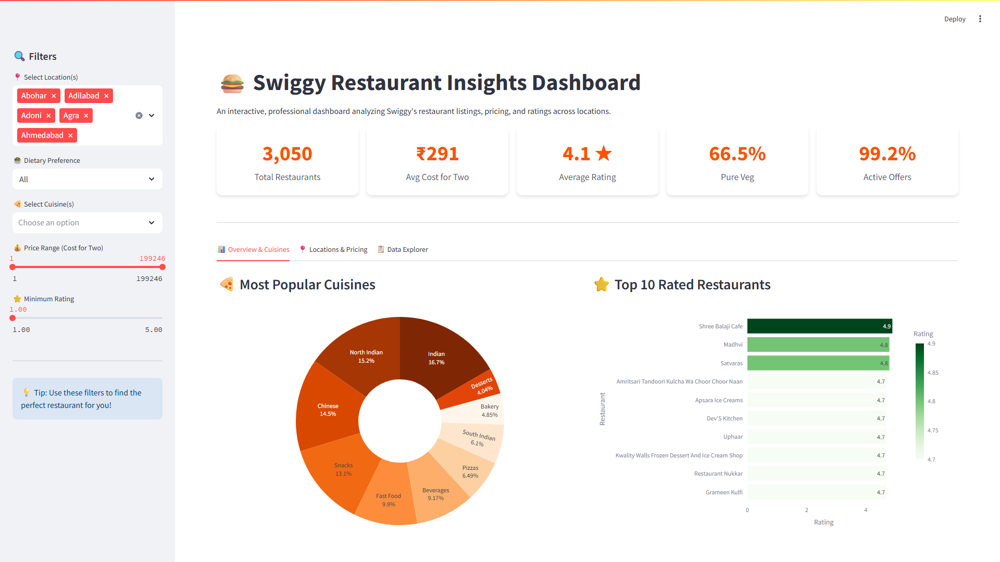

# Swiggy-Data-Driven-Insights

### 🚀 End-to-End Analysis for Pricing, Customer Behavior & Business Insights  

---

## 🌟 Interactive Streamlit Dashboard (NEW!)

We have recently added a fully interactive web dashboard built with **Streamlit**. This allows anyone visiting the repository to visually explore restaurant data, apply filters, and see dynamic visual insights.

### How to Run the Streamlit Dashboard Locally
1. Ensure you have Python installed.
2. Install the required libraries:
   ```bash
   pip install -r requirements.txt
   ```
3. Run the dashboard:
   ```bash
   streamlit run app.py
   ```
4. It will automatically open in your default web browser!

---

## 📊 Dashboard Preview  




---

## 📌 Project Overview  
This project demonstrates how **data analytics transforms raw restaurant data into meaningful business insights**. Using Python, we analyzed pricing, ratings, and customer behavior to support **data-driven decision-making**.

---

## 🎯 Objectives  
- Understand restaurant pricing behavior  
- Analyze customer preferences using ratings  
- Identify high-performing locations and cuisines  
- Perform time-based trend analysis (MoM, YoY)  
- Apply hypothesis testing for statistical validation  
- Generate business recommendations  

---

## 🛠️ Tech Stack  
- Python 🐍  
- Pandas & NumPy  
- Plotly (Interactive Visualization)  
- Statsmodels (Time Series Analysis)  
- Jupyter Notebook  
- **Streamlit** (Web Dashboard)

---

## 📂 Project Workflow  

### 🔹 Phase 1: Data Preparation  
- Data Understanding  
- Data Cleaning  
- Handling Missing Values  
- Outlier Detection & Removal  

---

### 🔹 Phase 2: Exploration  
- Univariate Analysis  
- Bivariate Analysis  
- Grouping & Aggregation  
- Pivot Tables  

---

### 🔹 Phase 3: Metrics & Features  
- KPI Calculations  
- Ranking  
- Cumulative Metrics  
- Moving Average  

---

### 🔹 Phase 4: Time Analysis  
- Trend Analysis  
- Month-over-Month (MoM)  
- Year-over-Year (YoY)  
- Seasonal Decomposition  
- Noise Handling  

---

### 🔹 Phase 5: Visualization  
- Interactive charts using Plotly  
- Dashboard-style analysis  

---

### 🔹 Phase 6: Advanced Analysis  
- Data Pipeline  
- Hypothesis Testing  

---

## 📊 Key Insights  

- Pricing depends on **rating, cuisine, and location**  
- Higher-rated restaurants tend to have **higher prices**  
- Clear segmentation between **budget and premium cuisines**  
- Location significantly impacts **pricing and competition**  
- Non-veg restaurants show **higher pricing variability**  
- Most restaurants fall in a **mid-price, mid-rating range**  
- Top-rated restaurants are limited → strong competitive advantage  
- Hypothesis testing proves that **rating significantly affects price**  

---

## 💡 Business Recommendations  

- Improve ratings to increase **pricing power and revenue**  
- Apply **segmented pricing strategies**  
- Focus on **high-performing locations and cuisines**  
- Standardize pricing to build **customer trust**  
- Promote top-rated restaurants to increase **visibility and conversions**  
- Optimize low-rated high-price restaurants  
- Use **data-driven marketing strategies**  
- Monitor KPIs for continuous improvement  

---

## 🧪 Hypothesis Testing  

- **Null Hypothesis (H₀):** Rating does not affect price  
- **Alternative Hypothesis (H₁):** Rating affects price  
- **Result:** H₀ rejected → Rating significantly impacts pricing  

---

## 📊 Key Concepts Covered  

- EDA (Exploratory Data Analysis)  
- Outlier Detection  
- Grouping & Aggregation  
- Pivot Tables  
- KPI Metrics  
- Trend Analysis  
- MoM & YoY Growth  
- Seasonal Decomposition  
- Noise Handling  
- Hypothesis Testing  

---

## 📌 Conclusion  

This project highlights how **data analytics enables businesses to make smarter decisions** by uncovering patterns in pricing, customer behavior, and performance.

---

## 🔥 Final Statement  

👉 *"Data-driven decisions are the key to building smarter, more competitive, and customer-focused businesses."*

---

## 👥 Team Members  

- **Rohith Kumar P** – Data Analysis, Visualization, Business Insights  
- **Rajashree P** – Data Processing, EDA, Support Analysis  

---

## ⭐ If you like this project  
Give it a ⭐ on GitHub and share your feedback!
